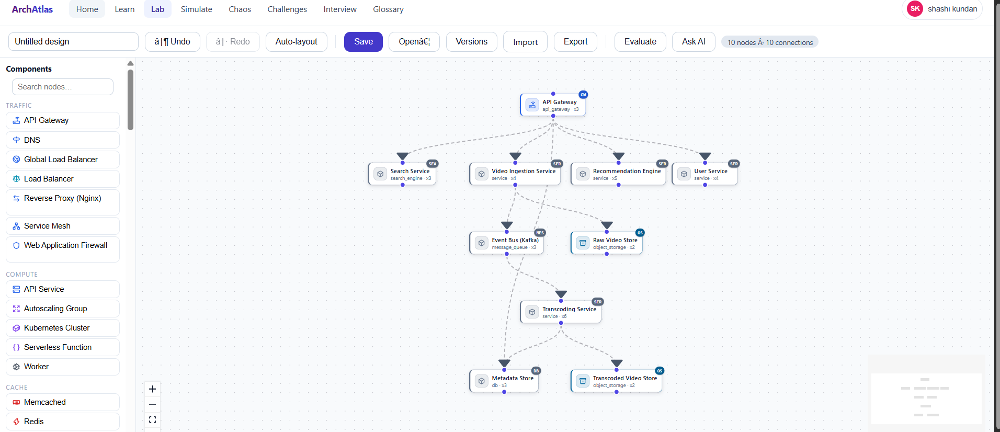
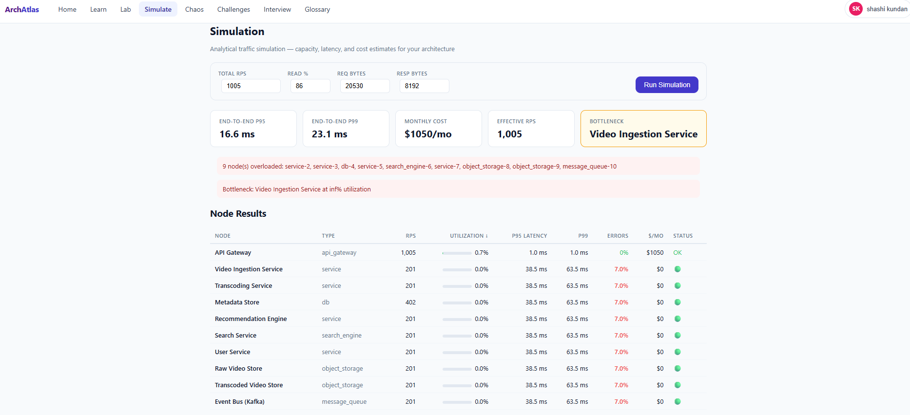
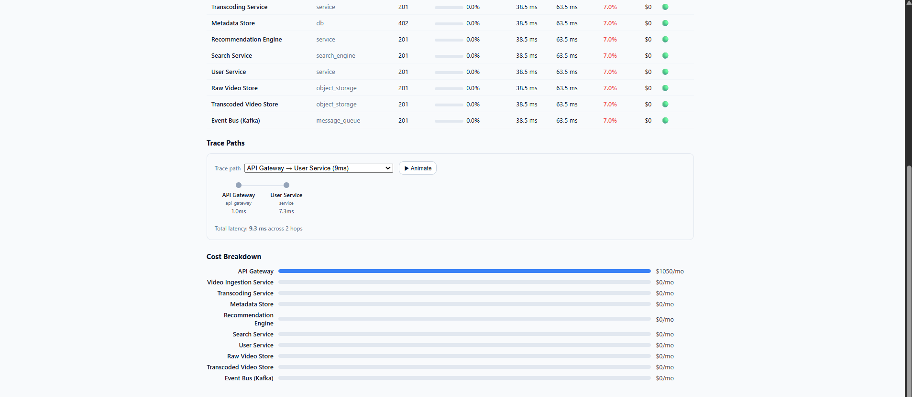
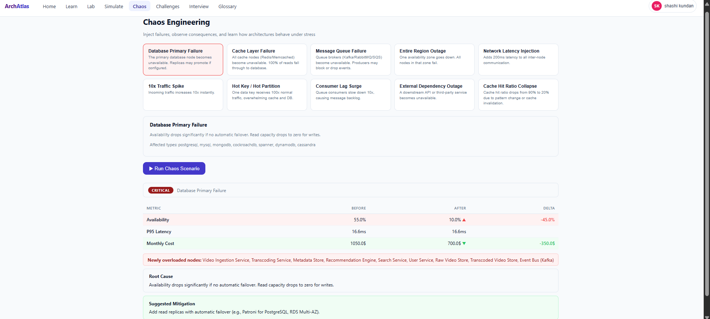

# ArchAtlas

Interactive system-design learning platform: **learn → build → evaluate →
diagnose → modify → re-evaluate → understand**.

Learners construct architectures on a canvas; the architecture is stored as a
canonical, machine-readable graph (`ArchitectureGraph`); a deterministic
evaluation engine analyzes it against requirements with evidence-backed
results; AI agents explain, hint, and critique — never silently modify.

- Product/architecture spec: [`SYSTEM.md`](./SYSTEM.md)
- Implementation plan & roadmap: [`PLAN.md`](./PLAN.md)

---

## Screenshots

### Home Screen


The landing page greets learners with the platform overview and primary navigation. From here users can jump into any module — Learn, Lab, Challenges, Simulate, Chaos, Interview — or sign in with Google to unlock AI-powered features (Ask AI, Interview Simulator). The hero section explains the platform's core loop: drag-and-drop → evaluate → iterate.

---

### Learn — System Design Topic Encyclopedia


The Learn module presents 48+ system design topics organized by category (load balancers, databases, caches, message queues, storage, networking, compute, and 14 AI/GenAI components). Each topic card shows a one-line summary and difficulty tag. Users can search, filter, and click into any topic for the full encyclopedia entry.


Each topic detail page shows the component's role, when to use it, scaling characteristics, and key trade-offs. This serves as both a reference guide and a learning tool — users read about a component before placing it on their architecture canvas.

---

### Lab — Drag-and-Drop Architecture Canvas


The core of ArchAtlas: a full-featured drag-and-drop canvas built on React Flow. The left palette contains 96 node types (85 traditional + 14 AI/GenAI) organized by category. Users drag components onto the canvas, connect them with edges (representing traffic flows), and configure each node's properties. The canvas supports zoom, pan, minimap, multi-select, and auto-layout. When ready, users export to a canonical `ArchitectureGraph` or click **Run Evaluation** for instant deterministic feedback.

---

### Lab Screenshot — Expanded Canvas View



A broader view of the architecture canvas showing a more complex topology — multiple load balancers, application tiers, databases, caches, and message queues interconnected. Edges display animated flow indicators with typed markers (sync/async streams). The right-click context menu allows configuring node properties or deleting connections. The minimap in the corner gives a bird's-eye view of large architectures.

---

### Challenges — Guided Practice with Auto-Grading


The Challenges module offers 46 structured exercises (including 10 AI/GenAI-specific challenges). Each challenge presents a real-world scenario — "Design a URL shortener at 100M daily active users" — with explicit requirements, constraints, and evaluation criteria. Users browse by category (availability, scalability, consistency, performance, security, cost) or difficulty.


Inside a challenge run, learners build their solution on the same drag-and-drop canvas, but now the evaluation engine grades against the challenge's specific requirements. Each requirement shows a pass/fail badge with evidence from the engine. Users can request AI hints (which don't spoil the answer) and see exactly which architectural decisions contributed to or detracted from their score.


The evaluation results panel shows a detailed breakdown: per-rule pass/fail status, bottleneck identification, capacity analysis, and cost estimation. The deterministic engine evaluates 55+ rule IDs — including SPOF detection, reachability checks, capacity adequacy, cache hit ratio feasibility, and latency budgets — all with traceable evidence tied back to specific graph nodes and edges.

---

### Simulation Layer — Analytical Performance Modeling



The Simulation module runs analytical performance modeling on any architecture. Users input traffic parameters (requests/sec, read/write ratio, payload size), then the engine computes per-node throughput, latency (p50/p95/p99), error rates, and cost. The summary cards show aggregate totals — total capacity, average latency, estimated monthly cost — giving learners an immediate sense of their architecture's performance profile.



The detailed simulation view breaks down results per node: each component's utilization percentage, queue depth, saturation point, and contribution to end-to-end latency. The trace view shows the critical path through the architecture — hop-by-hop latency, which nodes are bottlenecks, and where capacity is wasted. Cost breakdown shows per-component monthly spend. All numbers are deterministic and reproducible.

---

### Chaos Engineering — Injecting Real-World Failures



The Chaos module lets learners inject 10 types of real-world failures into their architecture and observe the impact. Event types include node failures, latency injection, traffic spikes, cache evictions, hot partitions, consumer slowdowns, and packet loss. Each event shows its description and severity classification. After injection, the delta report shows before/after metrics — availability drop, latency increase, throughput degradation — with root cause analysis and mitigation suggestions. This teaches learners to design for resilience, not just happy-path correctness.

---

### Interview Simulator — 12-Phase State Machine


The Interview Simulator walks learners through a realistic system design interview, progressing through 12 phases: requirements gathering → scale estimation → API design → data modeling → architecture design → bottleneck identification → scaling strategies → consistency trade-offs → availability guarantees → failure handling → observability setup → final trade-off discussion. The AI interviewer asks probing questions, evaluates answers against the learner's actual architecture graph, and provides feedback. Each phase builds on the previous one, simulating the real pressure and structure of a 45-minute system design interview.

---

## Status — Phase 10 (Collaborative Platform)

| Piece | State |
|---|---|
| Canonical JSON Schemas (9) | ✅ `schemas/` |
| Pydantic codegen + drift check | ✅ `backend/scripts/gen_models.py` |
| TS types codegen + drift check | ✅ `frontend/scripts/generate-types.mjs` |
| Backend API (health, components, evaluate, agent, interview, simulate, chaos, architectures) | ✅ FastAPI |
| Frontend pages (Home, Learn, Lab, Simulate, Chaos, Challenges, Interview, Compare, Shared, Glossary, Login) | ✅ Vite + React Flow |
| Component catalog (96 nodes incl. 14 AI/GenAI) | ✅ `content/components/` |
| Rule registry (55+ rule ids) | ✅ `content/rules/rules.yaml` |
| Challenge packs (46 challenges incl. 10 AI/GenAI) | ✅ `content/challenges/` |
| Node encyclopedia guides (96 guides) | ✅ `content/guides/` |
| AI Mentor Coach (multi-provider) | ✅ Phase 5 |
| Interview Agent (12-phase state machine) | ✅ Phase 6 |
| Simulation Layer (analytical engine) | ✅ Phase 7 |
| Chaos Engineering (10 event types + injection + delta reports) | ✅ Phase 8 |
| AI/GenAI Systems Lab (14 components + 10 challenges) | ✅ Phase 9 |
| Collaborative Platform (share links + compare mode + version diff) | ✅ Phase 10 |
| Google OAuth login | ✅ |

## Quickstart

### Native (two terminals)

```bash
# Terminal 1 - backend
cd backend
python -m venv .venv
.venv\Scripts\pip install -e ".[dev]"        # POSIX: source .venv/bin/activate
.venv\Scripts\pytest                         # 10 tests
.venv\Scripts\uvicorn app.main:app --reload  # http://localhost:8000/docs

# Terminal 2 - frontend
cd frontend
npm install
npm run generate:types   # regenerate TS from schemas/ if they changed
npm run dev              # http://localhost:5173
```

Open http://localhost:5173 — connect nodes on the canvas and hit
**Export canonical JSON** to see the `ArchitectureGraph` contract.

### Docker Compose

```bash
docker compose up --build          # web :8080, api :8000
docker compose --profile ollama up # adds local LLM runtime :11434 (Phase 5 path)
```

## Repository Map

```text
schemas/                  canonical JSON Schemas - single source of truth
backend/app/
  api/routes/             HTTP layer (thin)
  core/config.py          settings (SDP_ env prefix)
  content/loader.py       content loading w/ schema validation (fail loudly)
  domain/schemas_generated/  GENERATED pydantic models - do not edit
frontend/src/
  graph/toArchitectureGraph.ts  canvas -> canonical graph adapter (pure)
  types/generated/              GENERATED TS types - do not edit
content/
  components/             versioned component catalog + knowledge blocks
  rules/rules.yaml        deterministic rule registry (55 ids)
  challenges/CONCEPTS.md  challenge family concepts (24)
tests/golden_architectures/  golden fixture runner home (Phase 3+)
docs/adr/                 architecture decision records
```

## Ground Rules (enforced by review + CI)

1. Schemas are the contract: change `schemas/`, then regenerate both sides.
2. Generated code is never hand-edited; CI fails on drift.
3. No evaluation rules in React; no provider-specific LLM logic in domain code.
4. Canvas is a view — `toArchitectureGraph` is the only bridge.
5. Content files failing validation crash startup, never skip silently.

See `PLAN.md` §61–64 for the full agent development rules.
