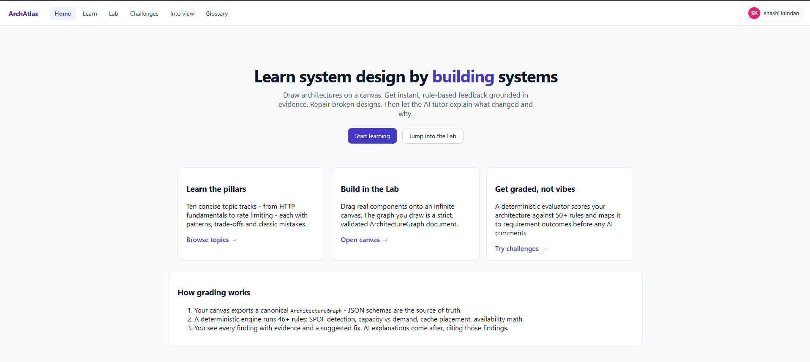
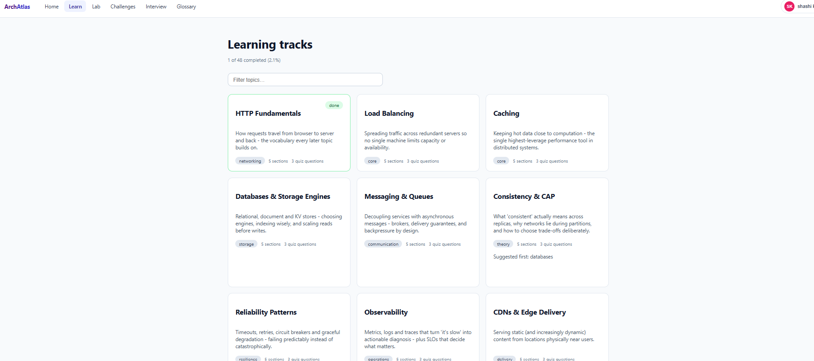
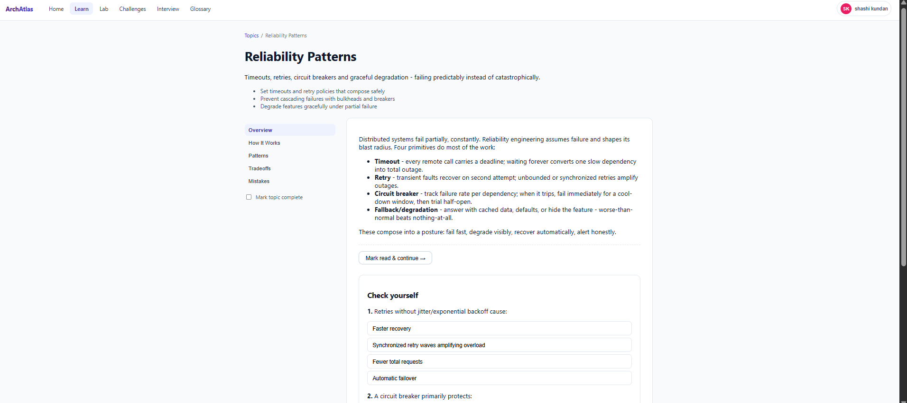
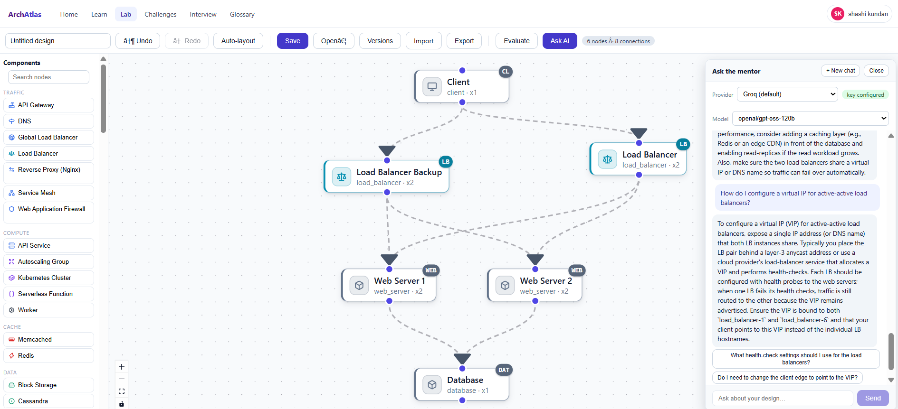
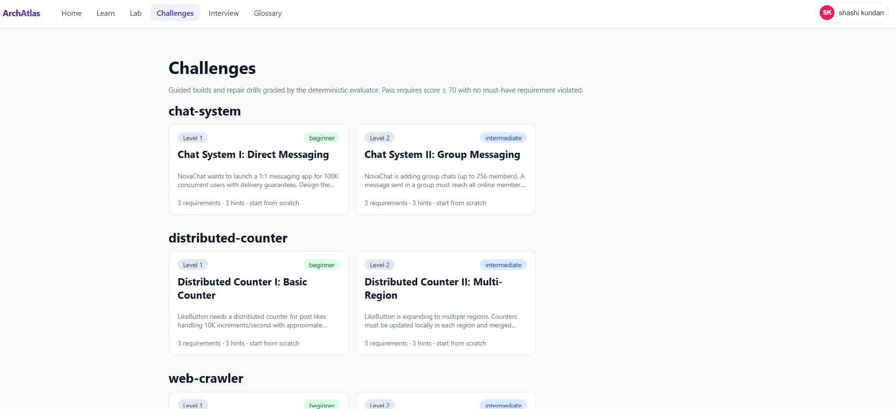
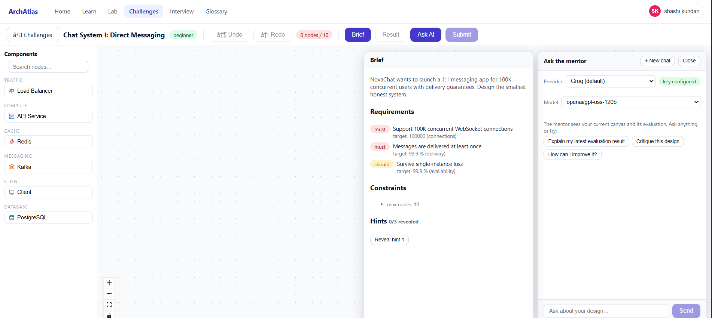
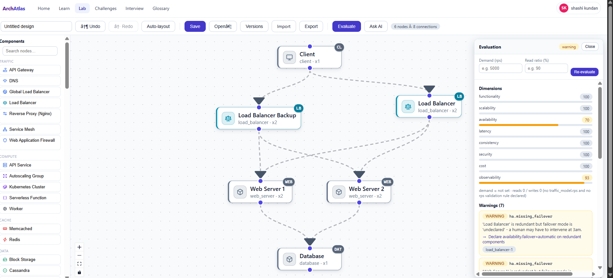
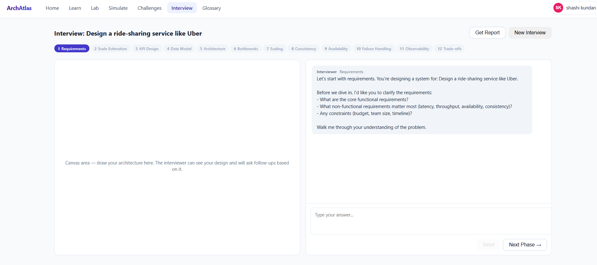

# ArchAtlas

Interactive system-design learning platform: **learn → build → evaluate →
diagnose → modify → re-evaluate → understand**.

Learners construct architectures on a canvas; the architecture is stored as a
canonical, machine-readable graph (`ArchitectureGraph`); a deterministic
evaluation engine analyzes it against requirements with evidence-backed
results; AI agents explain, hint, and critique — never silently modify.

- Product/architecture spec: [`SYSTEM.md`](./SYSTEM.md)
- Implementation plan & roadmap: [`PLAN.md`](./PLAN.md)

## Screenshots

### Home


### Learn — System Design Topics



### Lab — Drag & Drop Canvas


### Challenges




### Interview Simulator


## Status — Phase 7 (Simulation Layer)

| Piece | State |
|---|---|
| Canonical JSON Schemas (9) | ✅ `schemas/` |
| Pydantic codegen + drift check | ✅ `backend/scripts/gen_models.py` |
| TS types codegen + drift check | ✅ `frontend/scripts/generate-types.mjs` |
| Backend API (health, components, evaluate, agent, interview, simulate) | ✅ FastAPI |
| Frontend smoke lab | ✅ Vite + React Flow canvas → canonical JSON export |
| Component catalog (85 nodes) | ✅ `content/components/` |
| Rule registry (55 rule ids) | ✅ `content/rules/rules.yaml` |
| Challenge packs (36 challenges) | ✅ `content/challenges/` |
| Node encyclopedia guides (85 guides) | ✅ `content/guides/` |
| AI Mentor Coach (multi-provider) | ✅ Phase 5 |
| Interview Agent (12-phase state machine) | ✅ Phase 6 |
| Simulation Layer (analytical engine) | ✅ Phase 7 |
| Google OAuth login | ✅ |
| Chaos Engineering | 🔄 Phase 8 |
| AI/GenAI Systems Lab | 📋 Phase 9 |
| Collaborative Platform | 📋 Phase 10 |

## Quickstart

### Native (two terminals)

```bash
# Terminal 1 - backend
cd backend
python -m venv .venv
.venv\Scripts\pip install -e ".[dev]"        # POSIX: source .venv/bin/activate
.venv\Scripts\pytest                         # 10 tests
.venv\Scripts\uvicorn app.main:app --reload  # http://localhost:8000/docs

# Terminal 2 - frontend
cd frontend
npm install
npm run generate:types   # regenerate TS from schemas/ if they changed
npm run dev              # http://localhost:5173
```

Open http://localhost:5173 — connect nodes on the canvas and hit
**Export canonical JSON** to see the `ArchitectureGraph` contract.

### Docker Compose

```bash
docker compose up --build          # web :8080, api :8000
docker compose --profile ollama up # adds local LLM runtime :11434 (Phase 5 path)
```

## Repository Map

```text
schemas/                  canonical JSON Schemas - single source of truth
backend/app/
  api/routes/             HTTP layer (thin)
  core/config.py          settings (SDP_ env prefix)
  content/loader.py       content loading w/ schema validation (fail loudly)
  domain/schemas_generated/  GENERATED pydantic models - do not edit
frontend/src/
  graph/toArchitectureGraph.ts  canvas -> canonical graph adapter (pure)
  types/generated/              GENERATED TS types - do not edit
content/
  components/             versioned component catalog + knowledge blocks
  rules/rules.yaml        deterministic rule registry (55 ids)
  challenges/CONCEPTS.md  challenge family concepts (24)
tests/golden_architectures/  golden fixture runner home (Phase 3+)
docs/adr/                 architecture decision records
```

## Ground Rules (enforced by review + CI)

1. Schemas are the contract: change `schemas/`, then regenerate both sides.
2. Generated code is never hand-edited; CI fails on drift.
3. No evaluation rules in React; no provider-specific LLM logic in domain code.
4. Canvas is a view — `toArchitectureGraph` is the only bridge.
5. Content files failing validation crash startup, never skip silently.

See `PLAN.md` §61–64 for the full agent development rules.
